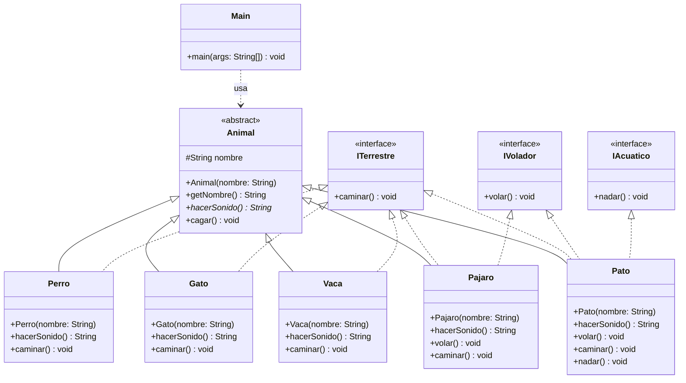

# Ejercicio de Polimorfismo en Java

Ejercicio básico que muestra polimorfismo en Java usando una jerarquía de animales:
una clase abstracta `Animal`, varias subclases que implementan `hacerSonido()` cada una a su manera,
y un conjunto de interfaces (`ITerrestre`, `IVolador`, `IAcuatico`) que modelan las capacidades de movimiento de cada animal.

## Estructura

```
poli1/
├── Main.java
└── dominio/
    ├── Animal.java
    ├── ITerrestre.java
    ├── IVolador.java
    ├── IAcuatico.java
    ├── Perro.java
    ├── Gato.java
    ├── Vaca.java
    ├── Pajaro.java
    └── Pato.java
```

- `dominio/Animal.java` — clase abstracta base (paquete `dominio`).
- `dominio/ITerrestre.java` — interfaz con el método `caminar()`.
- `dominio/IVolador.java` — interfaz con el método `volar()`.
- `dominio/IAcuatico.java` — interfaz con el método `nadar()`.
- `dominio/Perro.java`, `Gato.java`, `Vaca.java` — subclases concretas que implementan `ITerrestre`.
- `dominio/Pajaro.java` — subclase concreta que implementa `IVolador` e `ITerrestre`.
- `dominio/Pato.java` — subclase concreta que implementa `IAcuatico`, `ITerrestre` e `IVolador`.
- `Main.java` — importa las clases de `dominio`, recorre un arreglo de tipo `Animal[]` y llama `hacerSonido()` polimórficamente.

## Diagrama de clases



## Ejecutar

```bash
javac dominio/*.java Main.java
java Main
```

### Salida esperada

```
Firulais dice: Guau guau y 
Estoy cagando
Michi dice: Miau y 
Estoy cagando
Lola dice: Muu y 
Estoy cagando
Donald dice: Cuac y 
Estoy cagando
```
